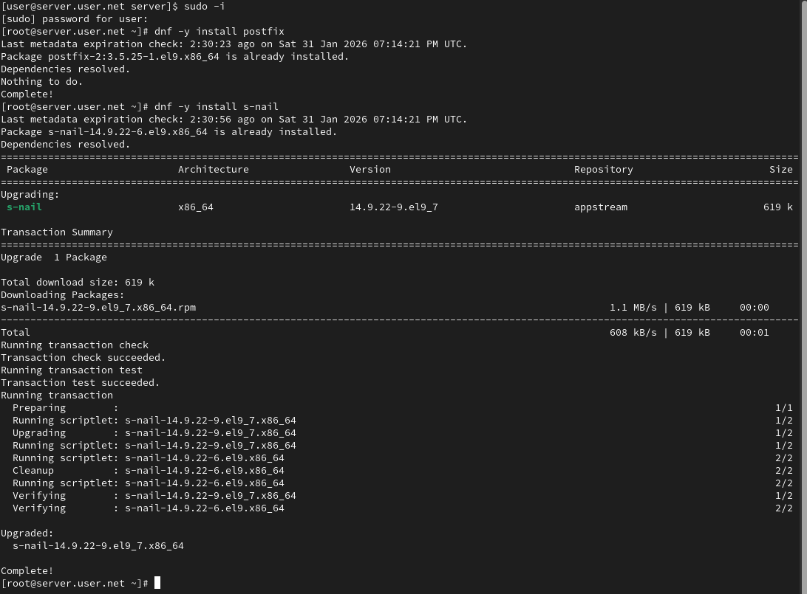
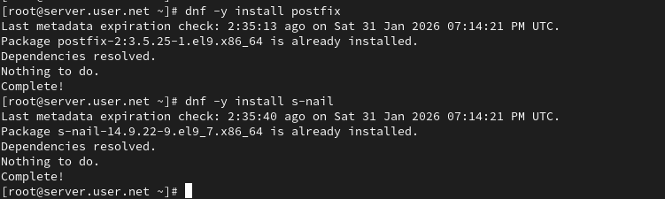
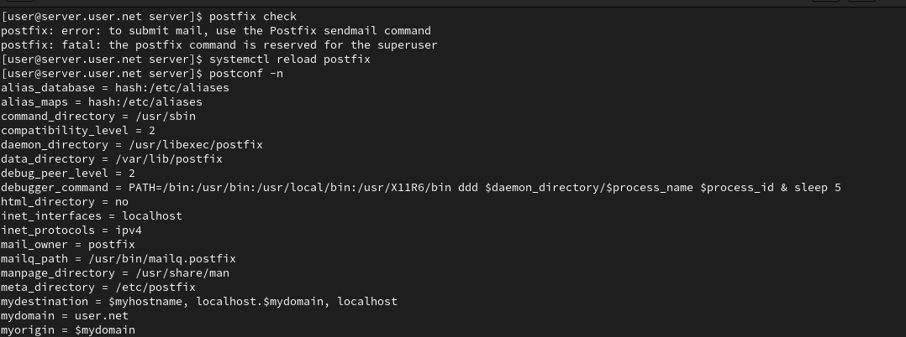
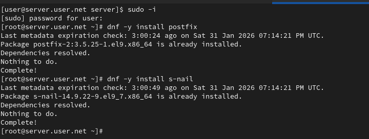
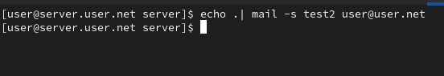
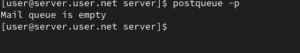

---
## Author
author:
  name: Пакавира Арсениу Висенте Луиш
  degrees: Student (3 курс)
  orcid: ""
  email: 1032225105@pfur.ru
  affiliation:
    - name: Российский университет дружбы народов
      country: Российская Федерация
      postal-code: 117198
      city: Москва
      address: ул. Миклухо-Маклая, д. 6

## Title
title: "Отчёт по лабораторной работе №8"
subtitle: "Дисциплина: Администрирование сетевых подсистем"
license: "CC BY"
---

# Цель работы

Приобретение практических навыков по конфигурированию SMTP-сервера в части настройки аутентификации.

# Выполнение лабораторной работы

## Настройка LMTP в Dovecote

Вход в систему выполнен под пользователем с последующим переходом в режим суперпользователя с помощью команды `sudo -i`, что подтверждается приглашением `root@server` ([рис. @fig-1]). Это обеспечивает права для изменения конфигурации почтовых служб.

{#fig-1 width=70%}

В дополнительном терминале запущен мониторинг журнала почтовой службы командой `tail -f /var/log/maillog`, что позволяет в реальном времени отслеживать события Postfix и Dovecot, включая запуск демонов и обработку соединений ([рис. @fig-1]).

В конфигурационном файле `/etc/dovecot/dovecot.conf` в список обслуживаемых протоколов добавлен протокол LMTP посредством строки `protocols = imap pop3 lmtp`, что расширяет функциональность Dovecot для работы с LMTP ([рис. @fig-2]).

{#fig-2 width=70%}

В файле `/etc/dovecot/conf.d/10-master.conf` выполнена настройка сервиса `lmtp`, где определён unix-сокет `/var/spool/postfix/private/dovecot-lmtp` с параметрами доступа `user = postfix`, `group = postfix`, `mode = 0600`, обеспечивающими взаимодействие Dovecot с Postfix через локальный сокет ([рис. @fig-3]).

{#fig-3 width=70%}

В конфигурации Postfix параметр `mailbox_transport` переопред7елён командой `postconf -e 'mailbox_transport = lmtp:unix:private/dovecot-lmtp'`, что направляет доставку почты через unix-сокет Dovecot вместо прямой локальной доставки ([рис. @fig-4]).

{#fig-4 width=70%}

В файле `/etc/dovecot/conf.d/10-auth.conf` установлен формат имени пользователя `auth_username_format = %Ln`, что обеспечивает аутентификацию по логину без доменной части ([рис. @fig-5]).

{#fig-5 width=70%}

После внесения изменений выполнен перезапуск служб `postfix` и `dovecot` командами `systemctl restart postfix` и `systemctl restart dovecot`, что активирует обновлённые параметры конфигурации ([рис. @fig-6]).

{#fig-6 width=70%}

С клиента отправлено тестовое письмо командой `echo .| mail -s "LMTP test" alkamal@alkamal.net`, что инициирует передачу сообщения через SMTP на сервер ([рис. @fig-8]).

{#fig-8 width=70%}

На сервере выполнена проверка почтового ящика пользователя с использованием переменной `MAIL=~/Maildir/` и команды `mail`. В списке сообщений отображается письмо с темой «LMTP test», что подтверждает корректную доставку через LMTP в каталог Maildir ([рис. @fig-9]).

{#fig-9 width=70%}

## Настройка SMTP-аутентификации

В файле `/etc/dovecot/conf.d/10-master.conf` определена служба аутентификации `service auth`, в которой задан unix-сокет `/var/spool/postfix/private/auth` с параметрами `user = postfix`, `group = postfix`, `mode = 0660`. Это обеспечивает доступ Postfix к механизму SASL-аутентификации Dovecot через локальный сокет. Дополнительно определён `unix_listener auth-userdb` с правами `mode = 0600` и пользователем `dovecot`, что ограничивает доступ к базе пользователей процессом Dovecot ([рис. @fig-10]).

{#fig-10 width=70%}

В Postfix задан тип SASL-аутентификации `dovecot` и путь к unix-сокету `private/auth` с помощью параметров `smtpd_sasl_type` и `smtpd_sasl_path`. Это настраивает smtpd на использование Dovecot как backend-аутентификатора ([рис. @fig-11]).

{#fig-11 width=70%}

Параметр `smtpd_recipient_restrictions` настроен с последовательностью:
`reject_unknown_recipient_domain` — отклонение писем для неизвестных доменов;
`permit_mynetworks` — разрешение для доверенной сети;
`reject_non_fqdn_recipient` — запрет некорректных адресов;
`reject_unauth_destination` — запрет релея для неразрешённых направлений;
`reject_unverified_recipient` — проверка существования получателя;
`permit` — окончательное разрешение при выполнении условий.
Это предотвращает использование сервера как SMTP relay ([рис. @fig-11]).

В параметре `mynetworks` установлено значение `127.0.0.0/8`, что ограничивает приём почты только локальными соединениями ([рис. @fig-11]).

В файле `/etc/postfix/master.cf` для сервиса `smtp` добавлены параметры `-o smtpd_sasl_auth_enable=yes` и модифицированы ограничения получателей, что временно включает аутентификацию на порту 25 для тестирования ([рис. @fig-12]).

{#fig-12 width=70%}

После внесения изменений выполнен перезапуск служб `postfix` и `dovecot`, что активирует новую конфигурацию аутентификации ([рис. @fig-13]).

{#fig-13 width=70%}

На клиенте установлен пакет `telnet` с использованием `dnf`, что позволяет выполнить ручное тестирование SMTP-соединения ([рис. @fig-14]).

{#fig-14 width=70%}

Сформирована строка аутентификации в формате base64 командой `printf 'alkamal\x00alkamal\x00123456' | base64`, затем выполнено подключение к SMTP-серверу по порту 25. После команды `EHLO test` сервер объявил поддержку `AUTH PLAIN`. Команда `AUTH PLAIN <base64>` завершилась ответом `235 2.7.0 Authentication successful`, что подтверждает корректную работу SASL-аутентификации через Dovecot ([рис. @fig-15]).

{#fig-15 width=70%}

##  Настройка SMTP over TLS

На сервере выполнено копирование временного сертификата и закрытого ключа Dovecot из каталога `/etc/pki/dovecot` в соответствующие подкаталоги `/etc/pki/tls/certs` и `/etc/pki/tls/private`, после чего в Postfix заданы параметры `smtpd_tls_cert_file`, `smtpd_tls_key_file`, `smtpd_tls_session_cache_database`, а также уровни безопасности `smtpd_tls_security_level = may` и `smtp_tls_security_level = may`, что активирует поддержку TLS для входящих и исходящих SMTP-соединений ([рис. @fig-16]).

{#fig-16 width=70%}

В файле `/etc/postfix/master.cf` оставлен стандартный сервис `smtp`, а также добавлен сервис `submission` на порту 587 с параметрами `-o smtpd_tls_security_level=encrypt`, `-o smtpd_sasl_auth_enable=yes` и ограничениями получателей, что обеспечивает обязательное использование TLS и аутентификации для клиентов ([рис. @fig-18]).

{#fig-18 width=70%}

В межсетевом экране разрешена служба `smtp-submission` командами `firewall-cmd --add-service=smtp-submission` и с сохранением правила `--permanent`, после чего выполнена перезагрузка конфигурации брандмауэра и перезапуск Postfix ([рис. @fig-19]).

{#fig-19 width=70%}

С клиента выполнено подключение к серверу по порту 587 с использованием `openssl s_client -starttls smtp -crlf -connect server.alkamal.net:587`. В процессе установлено TLS-соединение, отображена информация о самоподписанном сертификате, после чего сервер успешно принял команды `EHLO` и объявил поддержку `AUTH PLAIN` ([рис. @fig-20]).

{#fig-20 width=70%}

Проверка аутентификации выполнена командой `AUTH PLAIN <base64>`, сервер вернул ответ `235 2.7.0 Authentication successful`, что подтверждает корректную работу SMTP over TLS с SASL-аутентификацией ([рис. @fig-21]).

{#fig-21 width=70%}

В почтовом клиенте Evolution настроен SMTP-сервер с использованием порта 587, режима STARTTLS и обычного пароля, после чего отправлено тестовое сообщение с темой «test 5» ([рис. @fig-22]).

{#fig-22 width=70%}

На сервере выполнена проверка почтового ящика командой `MAIL=~/Maildir/ mail`, где отображается сообщение с темой «test 5», что подтверждает корректную доставку письма через защищённое соединение SMTP over TLS ([рис. @fig-23]).

{#fig-23 width=70%}

## Внесение изменений в настройки внутреннего

На виртуальной машине **server** выполнен переход в каталог `/vagrant/provision/server`, после чего конфигурационные файлы `dovecot.conf`, `10-master.conf`, `10-auth.conf`, а также `master.cf` Postfix скопированы в соответствующие подкаталоги `mail/etc/dovecot/` и `mail/etc/postfix/`. Это обеспечивает сохранение рабочей конфигурации служб для последующего автоматического развёртывания через provisioning ([рис. @fig-24]).

{#fig-24 width=70%}

В файл `/vagrant/provision/server/mail.sh` внесены изменения расширенной конфигурации SMTP-сервера: добавлена установка пакетов `postfix`, `dovecot`, `telnet`; копирование конфигурации в `/etc`; настройка firewall для служб `smtp`, `pop3`, `pop3s`, `imap`, `imaps`, `smtp-submission`; параметры Postfix (`mydomain`, `myorigin`, `inet_protocols`, `inet_interfaces`, `mydestination`); поддержка Maildir (`home_mailbox = Maildir/`); SASL-аутентификация через Dovecot (`smtpd_sasl_type`, `smtpd_sasl_path`); ограничения `smtpd_recipient_restrictions`; параметр `mynetworks`; а также конфигурация SMTP over TLS с указанием сертификата, ключа и уровня безопасности. В конце скрипта выполняются `postfix set-permissions`, `restorecon`, перезапуск служб Postfix и Dovecot ([рис. @fig-25]).

{#fig-25 width=70%}

В файл `/vagrant/provision/client/mail.sh` добавлена установка пакета `telnet` командой `dnf -y install telnet`, что обеспечивает возможность тестирования SMTP-соединения с клиента в процессе автоматической настройки виртуальной машины ([рис. @fig-26]).

{#fig-26 width=70%}

# Выводы

В ходе работы выполнена комплексная настройка почтового сервера на базе Postfix и Dovecot с поддержкой LMTP, SASL-аутентификации и SMTP over TLS.

Реализована доставка почты через LMTP-сокет Dovecot, что обеспечило корректную интеграцию MTA и MDA. Настроена SASL-аутентификация через Dovecot, исключающая несанкционированное использование сервера в качестве SMTP-relay. Ограничения `smtpd_recipient_restrictions` и параметр `mynetworks` обеспечили контроль приёма сообщений.

Настроена поддержка TLS с использованием сертификата Dovecot и реализован сервис submission (порт 587) с обязательным шифрованием и аутентификацией. Проверка через `openssl` и `AUTH PLAIN` подтвердила успешное установление защищённого соединения.

Отправка сообщений через telnet и почтовый клиент Evolution показала корректную работу SMTP over TLS и доставку писем в Maildir пользователя.

Конфигурация интегрирована в механизм provisioning виртуальной машины, что обеспечивает воспроизводимость настройки внутреннего окружения.

# Контрольные вопросы

1. Приведите пример задания формата аутентификации пользователя в
Dovecot в форме логина с указанием домена.

- ` auth_username_format = %Lu@%d`

2. Какие функции выполняет почтовый Relay-сервер?

- Почтовый Relay-сервер выполняет функции пересылки почты от одного
почтового сервера к другому, облегчая маршрутизацию электронных сообщений между различными почтовыми системами.

3. Какие угрозы безопасности могут возникнуть в случае настройки почтового
сервера как Relay-сервера?

Угрозы безопасности, связанные с настройкой почтового сервера как Relay-сервера, могут включать рассылку нежелательной почты (спам), перехват и
изменение электронных сообщений, а также использование сервера для
ретрансляции вредоносных сообщений.
